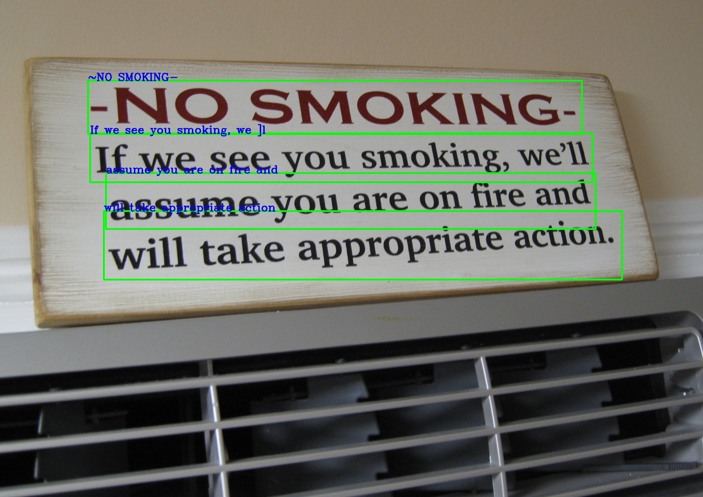
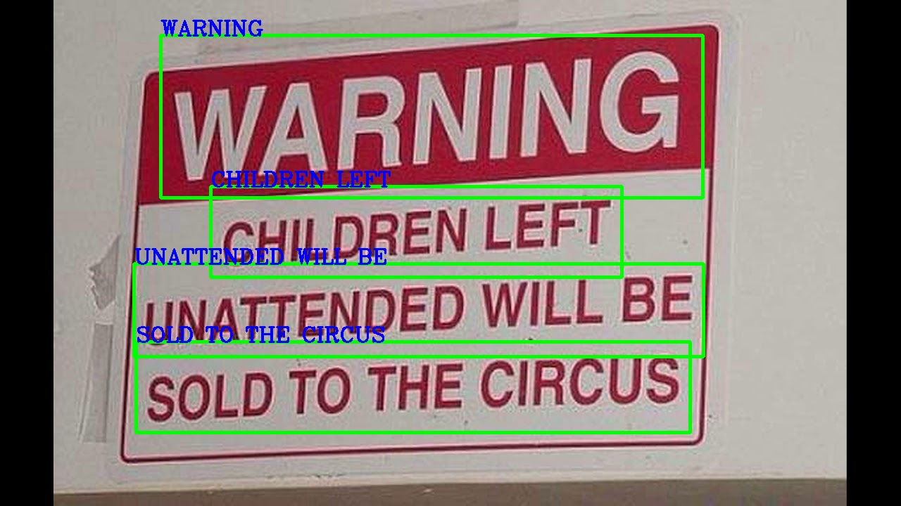

### Модель распознавания символов на знаках

**Задача:** Распознать символы на трёх знаках, выведя результат на само изображение.

**Решение:** С помощью модели EasyOCR распознаются 3 фото. На 2 фото распознаёт листья, как текст. Увеличение порога confidence scor'а для фильтра этой ошибки приводит к прекращению распознавания нужной части фото.

**Результат:**
Для распознования лучше выбирать изображения одного разрешения. Изменение порога для распознования текста для улучшения результатов на 1 фото неприменно ведут к ухудшению на других.

