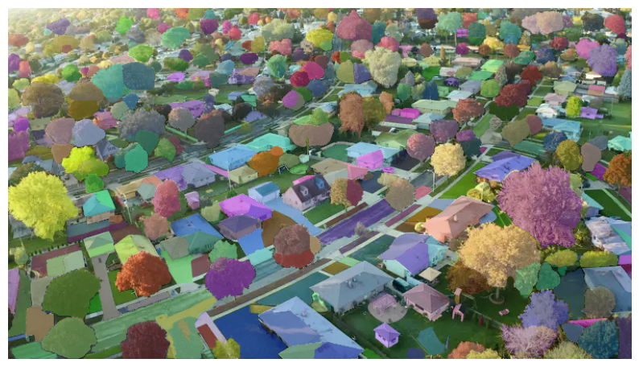

## Паноптический сегментатор на SAM

**Задача:** Произвести паноптическую сегментацию на фото города. 

**Решение:** Для инференса использовалась предобученная дефолтная модель `Segment Anything` за авторством какой-то запрещённой в РФ компании.

**Результат:**
Учитывая, что фото под углом, разрешение оригинального фото 800х450, маска генерилась автоматически и модель в своём изначальном назначении существует, чтобы отделять **элементы**, результат сносный. Во многих домах части (крыша, стены, окна) распознаются, как отдельные элементы, что есть дефолтной работой модели.

**Как можно улучшить:**
- Не генерировать маску автоматом, а использовать sam_with_prompts, где вручную задавать сущности для классификации.
- Выбрать не дефолтную (лёгкую) модель, а более тяжёлую.
- Не скармливать модели фото низкого разрешения.