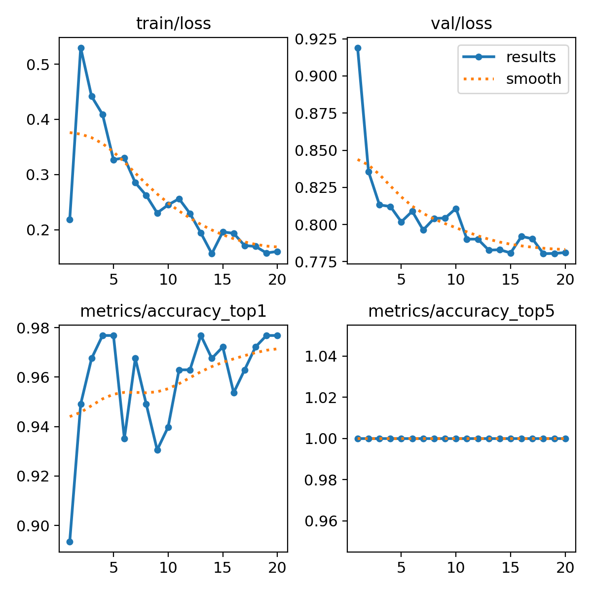
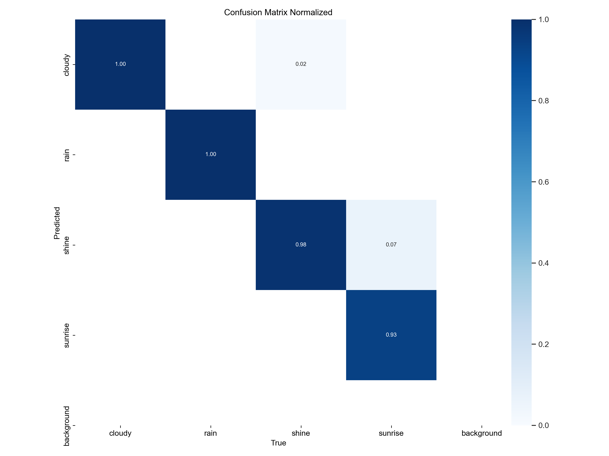

## Обучение мультиклассовой классификации Yolov8.

**Задача:** Определить 1 из 4 видов погоды по фото.

**Решение:** Предназначенная для обучения версия модели YOLOv8 обучается на датасете с погодой, разделённый на 4 класса. Параметры: 20 эпох, imgsz=64.

**Результат:**
В 7% случаев определния класса "солнечно" путает с "рассвет" и 2% "облачно" с "солнечно". Не осуждаю.

