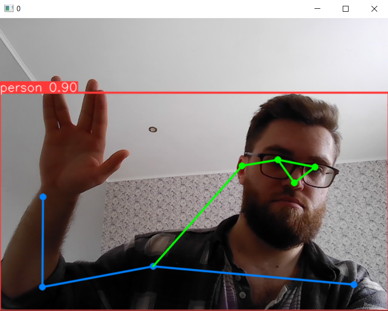

## Отслеживание позы по вебке на YOLOv8. 

**Задача:** Отобразить скелет позы с предобученной моделью Yolov8-pose.

**Решение:** Через cv2 делается инференс с помощью модели для каждого кадра вебки.

**Результат:**
Live long and prosper.
