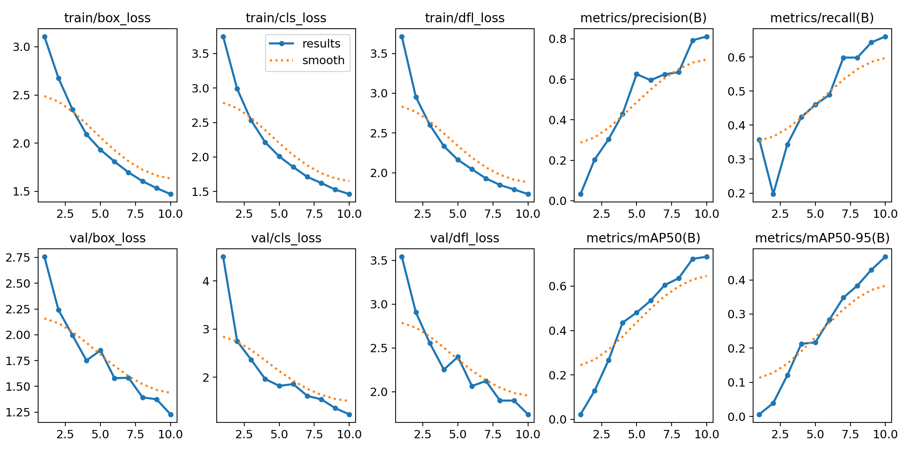
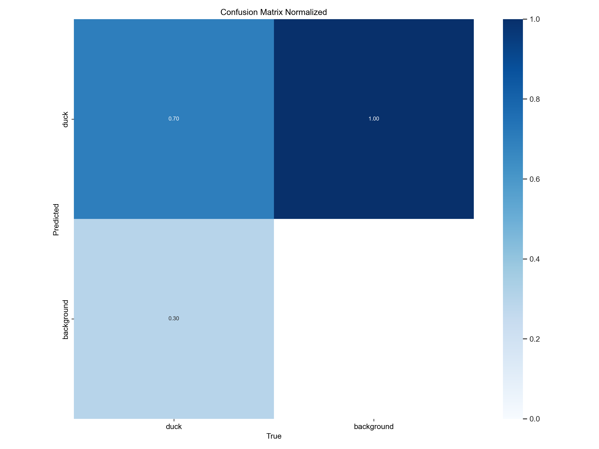
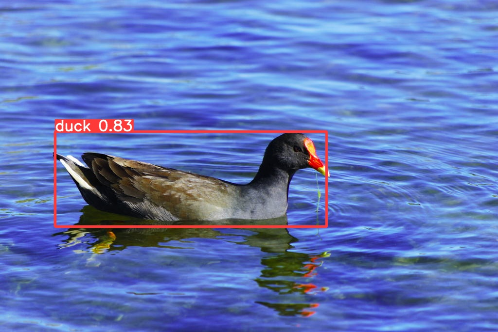
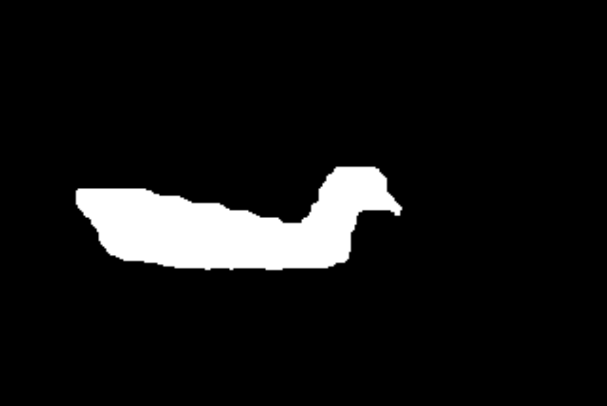

## Сегментация уток.

**Задача:** Обучить  модель для определения пикселей с утками.

**Решение:** YOLOv8n была обучена на кастомных данных (4150 фото уток в train и 65 в val) и проведён инференс для случайной утки с отрисовкой маски сегментации. Параметры: 15 эпох.

**Результат:**
Изучив данные обнаржуилось, что лейблинг на многих фото ленивый. На 1 фотографии может быть 3 утки, но лейбл есть только для 1 => можно улучшить качество инференса лучше разметив данные.

Графики сегментации:

Фото и маска:

